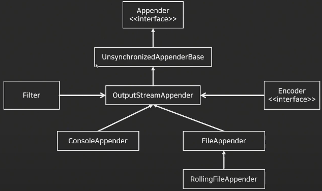
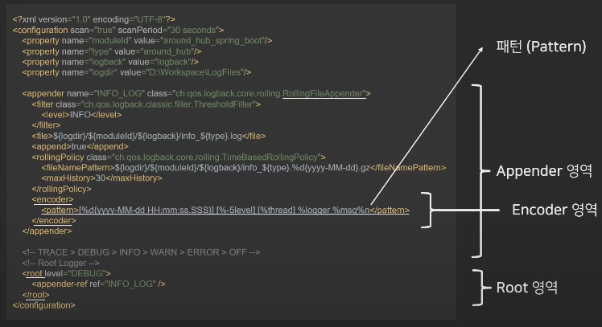
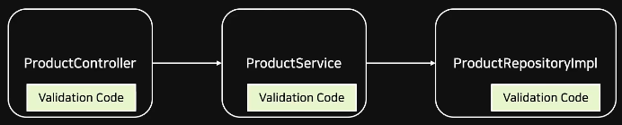
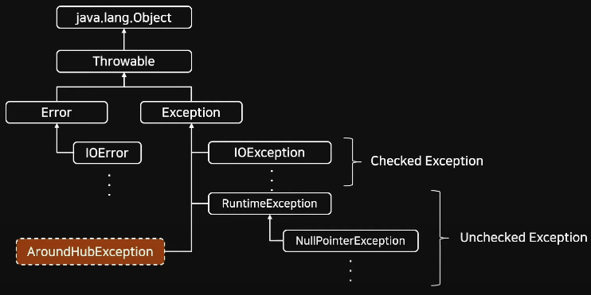
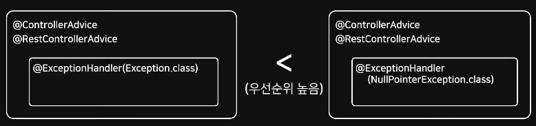
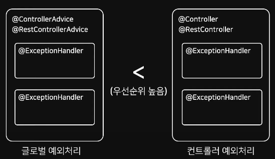
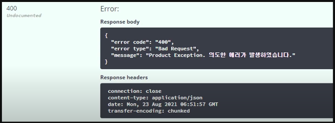
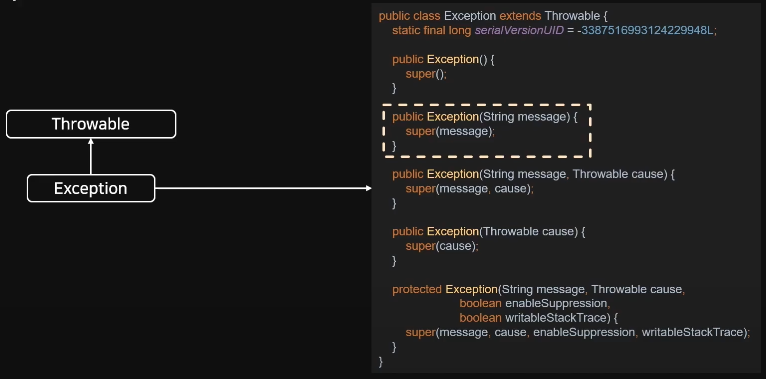
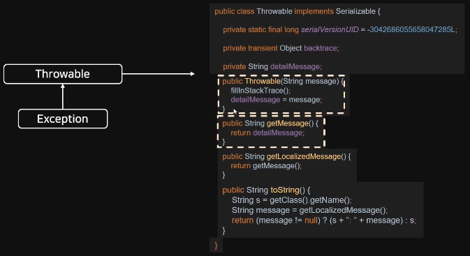
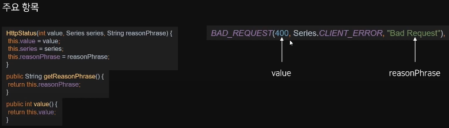

### Logback
+ Logback이란 Log4j를 기반으로 개발된 로깅(Logging) 라이브러리
+ Log4j에 비해 약 10배 정도 빠른 퍼포먼스, 메모리 효율성 증대
+ 출시순서: Log4j → Logback → Log4j2

`Logback 특징`
+ 로그에 특정 레벨을 설정할 수 있음 (Trace → Debug → Info → Warn → Error)
+ 실운영과 테스트 상황에서 각각 다른 출력 레벨을 설정하여 로그를 확인할 수 있음
+ 출력 방식에 대해 설정할 수 있음
+ 설정 파일을 일정 시간마다 스캔하여 어플리케이션 중단 없이 설정 변경 가능
+ 별도의 프로그램 없이 자체적으로 로그 압축을 지원
+ 로그 보관 기간 설정 가능

`Logback 구조`



`Logback 설정`
+ 일반적으로 Classpath에 있는 Logback 설정 파일을 참조하게 됨
+ Java Legacy, Spring의 경우 logback.xml 파일을 참조
+ Spring Boot의 경우 logback-spring.xml 파일을 참조



`appender`
+ Log의 형태 및 어디에 출력할지 설정하기 위한 영역
+ 대표적인 appender 형식은 아래와 같다
  + ConsoleAppender: 콘솔에 로그를 출력
  + FileAppender: 파일에 로그를 저장
  + RollingFileAppender: 여러 개의 파일을 순회하며 로그를 저장
  + SMTPAppender: 로그를 메일로 보냄
  + DBAppender: 데이터베이스에 로그를 저장

`encoder`
+ appender 내에 포함되는 항목이며, pattern을 사용하여 원하는 형식으로 로그를 표현

`root`
+ 설정한 appender를 참조하여 로그의 레벨을 설정할 수 있다
+ root는 전역 설정이며, 지역 설정을 위해서는 logger를 사용

`로그 레벨`
> TRACE > DEBUG > INFO > WARN > ERROR

+ ERROR: 로직 수행 중에 오류가 발생한 경우, 시스템적으로 심각한 문제가 발생하여 작동이 불가한 경우 출력
+ WARN: 시스템 에러의 원인이 될 수 있는 경고를 출력하지만 프로그램이 처리 가능한 사항인 레벨
+ INFO: 상태변경과 같은 정보성 메시지 출력
+ DEBUG: 애플리케이션의 디버깅을 위한 메시지 출력
+ TRACE: DEBUG 레벨보다 더 디테일한 메시지를 표현하기 위한 출력
+ 예를 들어, 로그 레벨을 'INFO'라고 설정할 경우 'TRACE','DEBUG' 레벨은 출력되지 않는다

`pattern`
+ ${PID:-}: 프로세스 id
+ %Logger{length}: Logger Name
+ %-5level: 로그 레벨, -5는 출력의 고정폭 값
+ %msg(%message): 로그 메시지 영역
+ %d: 로그 기록 시간
+ %p: 로깅 레벨
+ %F: 로깅이 발생한 프로그램 파일명
+ %M: 로깅이 발생한 메서드의 이름
+ %I: 로깅이 발생한 호출지의 정보
+ %L: 로깅이 발생한 호출지의 라인 수
+ %thread: 현재 Thread 명
+ %t: 로깅이 발생한 Thread 명
+ %c: 로깅이 발생한 카테고리
+ %C: 로깅이 발생한 클래스 명
+ %m: 로그 메시지
+ %n: 줄바꿈
+ %%: % 출력
+ %r: 애플리케이션 실행 후 로깅이 발생한 시점까지의 시간

---
### 유효성 검사/데이터 검증 (Validation)
+ 서비스의 비즈니스 로직이 올바르게 동작하기 위해 사용되는 데이터에 대한 사전 검증 작업이 필요하다
+ 유효성 검사 혹은 데이터 검증이라고 부르는데, 흔히 Validation이라고 부른다
+ 데이터의 검증은 여러 계층에서 발생하는 흔한 작업
+ Validation은 들어오는 데이터에 대해 의도한 형식의 값이 제대로 들어오는지 체크하는 과정을 뜻한다

`일반적인 Validation의 문제점`
+ 애플리케이션에서 사용되던 Validation 방식은 몇가지 문제가 존재한다
+ 애플리케이션 전체적으로 분산되어 존재한다
+ 코드의 중복이 심하다 (코드가 복잡해짐)
+ 비즈니스 로직에 섞여 있어 검사 로직 추적이 어렵다



`Bean Validation / Hibernate Validator`
+ 일반적인 Validation 문제를 해결하기 위해 Java에서 2009년 부터 Bean Validation이라는 데이터 유효성 검사 프레임워크를 제공한다
+ Bean Validation은 어노테이션을 통해 다양한 데이터를 검증할 수 있게 기능을 제공한다
+ Hibernate Validator는 Bean Validation 명세에 대한 구현체
+ Spring Boot 유효성 검사 표준은 Hibernate Validator를 채택한다
  + 이전 버전의 Spring Boot 에서는 starter-web에 validation이 포함되어 있었지만, 2.3버전 부터 starter-validation을 추가해야한다

`Validation 관련 어노테이션`
+ @Size: 문자의 길이 조건
+ @NotNull: null 값 불가
+ @NotEmpty: @NotNull + ""값 불가
+ @NotBlank: @NotEmpty + ""값 불가
+ @Past: 과거 날짜
+ @PastOrPresent: @Past + 오늘 날짜
+ @Future: 미래 날짜
+ @FutureOrPresent: @Future + 오늘 날짜
+ @Pattern: 정규식을 통한 조건
+ @Max: 최대값 조건 설정
+ @Min: 최소값 조건 설정
+ @AssertTime/AssertFalse: 참/거짓 조건 설정
+ @Valid: 해당 객체의 유형성 검사

---
### 예외 처리(Exception)
+ 스프링 부트의 예외 처리 방식은 크게 2가지가 존재한다
  + @ControllerAdvice를 통한 모든 Controller에서 발생할 수 있는 예외 처리
  + @ExceptionHandler를 통한 특정 Controller의 예외 처리
+ @ControllerAdvice로 모든 컨트롤러에서 발생할 예외를 정의하고, @ExceptionHandler를 통해 발생하는 예외마다 처리할 메서드를 정의

`예외 클래스`



+ 모든 예외 클래스는 `Throwable` 클래스를 상속 받고 있다
+ Exception은 수많은 자식 클래스가 있다
+ RuntimeException은 Unchecked Exception 이고, 그 외 Exception은 Checked Exception으로 볼 수 있다
+ `Checked Exception` 대표 예외
  + IOException
  + SQLException
+ `Unchecked Exception` 대표 예외
  + NullPointerException
  + IllegalArgumentException
  + IndexOutOfBoundException
  + SystemException

`@ControllerAdvice, @RestControllerAdvice`
+ @ControllerAdvice는 Spring에서 제공하는 어노테이션
+ @Controller나 @RestController에서 발생하는 예외를 한 곳에서 관리하고 처리할 수 있게 하는 어노테이션
+ 설정을 통해 범위 지정이 가능하며, Default 값으로 모든 Controller에 대해 예외 처리를 관리함
  + @RestControllerAdvice(basePackages = "boot.basic")와 같이 패키지 범위를 설정할 수 있다
+ 예외 발생 시 json의 형태로 결과를 반환하기 위해서는 @RestControllerAdvice를 사용하면 된다

`@ExceptionHandler`
+ 예외 처리 상황이 발생하면 해당 Handler로 처리하겠다고 명시하는 어노테이션
+ 어노테이션 뒤에 괄호를 붙여 어떤 ExceptionClass를 처리할지 설정할 수 있다
  + @ExceptionHandler(OOException.class)
+ Exception.class는 최상위 클래스로 하위 세부 예외 처리 클래스로 설정한 핸들러가 존재하면, 그 핸들러가 우선처리하게 되며 처리 되지 못하는 예외 처리에 대해 ExceptionClass에서 핸들링한다
+ @ControllerAdvice로 설정된 클래스 내에서 메서드로 정의할 수 있지만, 각 Controller 안에 설정도 가능하다
+ 전역 설정(@ControllerAdvice)보다 지역 설정(Controller)으로 정의한 Handler가 우선순위를 가진다

`우선 순위 도식화`





---
### Custom Exception
+ error type, error code, message 에서 필요한 내용은 아래와 같다
  + error type: HttpStatus의 responsePhrase
  + error code: HttpStatus의 value
  + message: 상황별 디테일 Message
+ 위 값들을 client에 응답해 어떤 에러가 발생했는지 공유하는 것



`Exception 구조`
+ 아래 그림으로 대부분의 예외 처리는 `Throwable` 처리되는 것을 추측해볼 수 있다
+ 생성자에서 전달받은 파라미터는 부모로 전달하여 처리한다



`Throwable 구조`



`HttpStatus`
+ HttpStatus는 Enum 클래스이다
+ Enum Class
  + 서로 관련 있는 상수들을 모아 심볼릭한 명칭의 집합으로 정의한 것
  + 클래스 처럼 보이게 하는 상수



---
### 테스트 코드

`TDD에 대한 간단한 정리`
+ 테스트 주도 개발이라는 의미를 가진다
+ 단순하게 표현하자면 테스트를 먼저 설계 및 구축 후 테스트를 통과할 수 있는 코드를 짜는 것
+ 코드 작성 후 테스트를 진행하는 지금까지 사용된 일반적인 방식과 다소 차이가 있다
+ 애자일 개발 방식 중 하나
  + 코드 설계시 원하는 단계적 목표에 대해 설정하여 진행하고자 하는 것에 대한 결정 방향의 갭을 줄이고자 한다
  + 최초 목표에 맞춘 테스트를 구축하여 그에 맞게 코드를 설계하기 때문에 보다 적은 의견 충돌을 기대할 수 있다 (방향 불일치로 인한 피드백과 진행 방향의 충동을 방지한다)

`테스트 코드를 작성하는 목적`
+ 코드의 안정성을 높일 수 있다
+ 기능을 추가하거나 변경하는 과정에서 발생할 수 있는 Side-Effect를 줄일 수 있다
+ 해당 코드가 작성된 목적을 명확하게 표현할 수 있다
  + 코드에 불필요한 내용이 들어가는 것을 비교적 줄일 수 있다

`JUnit`
+ Java 진영의 대표적인 Test Framework
+ 단위 테스트(Unit Test)를 위한 도구를 제공
  + 단위 테스트란?
  + 코드의 특정 모듈이 의도된 대로 동작하는지 테스트 하는 절차를 의미
  + 모든 함수와 메서드에 대한 각각의 테스트 케이스(Test Case)를 작성하는 것
+ 어노테이션(Annotation)을 기반으로 테스트를 지원
+ 단정문(Assert)으로 테스트 케이스의 기대 값에 대해 수행 결과를 확인할 수 있다
  + Spring Boot 2.2 버전 부터 JUnit 5 버전을 사용
  + Junit 5는 크게 Jupiter, Platform, Vintage 모듈로 구성됨

`JUnit 모듈 설명`
+ JUnit Jupiter
  + TestEngine API 구현체로 JUnit 5를 구현하고 있다
  + 테스트의 실제 구현체는 별도 모듈 역할을 수행하는데, 그 모듈 중 하나가 Jupiter-Engine이다
  + 이 모듈은 Jupiter-API를 사용하여 작성한 테스트 코드를 발견하고 실행하는 역할을 수행한다
  + 개발자가 테스트 코드를 자것ㅇ할 때 사용된다
+ JUnit Platform
  + Test를 실행하기 위한 뼈대
  + Test를 발견하고 테스트 계획을 생성하는 TestEngine 인터페이스를 가지고 있다
  + TestEngine을 통해 Test를 발견하고, 수행 및 결과를 보고한다
  + 그리고 각종 IDE 연동을 보조하는 역할을 수행한다 (콘솔 출력 등)
  + Platform = TestEngine API + Console Launcher + JUnit4 Based Runner 등
+ JUnit Vintage
  + TestEngine API 구현체로 JUnit 3,4를 구현하고 있다
  + 기존 JUnit 3,4 버전으로 작성된 테스트 코드를 실행할 때 사용된다
  + Vintage-Engine 모듈을 포함하고 있다

`JUnit LifeCycle Annotation`
+ `@Test`: 테스트용 메서드를 표현하는 어노테이션
+ `@BeforeEach`: 각 테스트 메서드가 시작되기 전에 실행되어야 하는 메서드를 표현
+ `@AfterEach`: 각 테스트 메서드가 시작된 후 실행되어야 하는 메서드를 표현
+ `@BeforeAll`: 테스트 시작 전에 실행되어야 하는 메서드를 표현 (static 처리 필요)
+ `@AfterAll`: 테스트 종료 후에 실행되어야 하는 메서드를 표현 (static 처리 필요)

`JUnit Main Annotation`
+ @SpringBootTest
  + 통합 테스트 용도로 사용된다
  + @SpringBootApplication을 찾아가 하위의 모든 Bean을 스캔하여 로드한다
  + 그 후 Test용 Application Context를 만들어 Bean을 추가하고, MockBean을 찾아 교체한다
+ @ExtendWith
  + JUnit 4에서 @RunWith로 사용되던 어노테이션이 ExtendWith로 변경되었다
  + @ExtendWith는 메인으로 실행될 Class를 지정할 수 있다
  + @SpringBootTest는 기본적으로 @ExtendWith가 추가되어 있다
+ @WebMvcTest({클래스이름}.class)
  + 파라미터에 작성된 클래스만 실제로 로드하여 테스트를 진행한다
  + 매개변수를 지정하지 않으면 @Controller, @RestController, @RestControllerAdvice 등 컨트롤러와 연관된 Bean이 모두 로드된다
  + 스프링의 모든 Bean을 로드하는 @SpringBootTest 대신 컨트롤러 관련 코드만 테스트할 경우 사용한다
+ @Autowired about MockBean
  + Controller의 API를 테스트하는 용도인 MockMvc 객체를 주입 받는다
  + perform() 메서드를 활용하여 컨트롤러의 동작을 확인할 수 있다
  + andExpect(), andDo(), andReturn() 등의 메서드를 같이 활용한다
+ @MockBean
  + 테스트할 클래스에서 주입 받고 있는 객체에 대해 가짜 객체를 생성해주는 어노테이션
  + 해당 객체는 실제 행위를 하지 않는다
  + given() 메서드를 활용하여 가짜 객체의 동작에 대해 정의하여 사용할 수 있다
+ @AutoConfigureMockMvc
  + spring.test.mockmvc 설정을 로드하면서 MockMvc 의존성을 자동으로 주입한다
  + MockMvc 클래스는 REST API 테스트를 할 수 있는 클래스
+ @Import
  + 필요한 Class들을 Configuration으로 만들어 사용할 수 있다
  + Configuration Component 클래스도 의존성 설정할 수 있다
  + Import된 클래스는 주입으로 사용 가능하다

`@Import vs @ContextConfiguration`
+ @Import
  + 목적: 해당 어노테이션은 특정 클래스나 설정을 현재 설정에 추가한다. 다른 구성 클래스나 `Bean`들을 현재 설정에 포함시키기 위해 사용된다
  + 사용법: 주로 테스트 클래스나 구성 클래스에서 다른 구성 클래스를 가져와서 재사용하거나, 특정 `Bean`들을 추가하고 싶을 때 사용한다. 

```java
@Configuration
@Import(value = {ProductDataHandlerImpl.class, ProductServiceImpl.class})
class AppConfig {
    // ...
}
```

+ @ContextConfiguration
  + 목적: 해당 어노테이션은 테스트 컨텍스트의 구성을 지정한다. 주로 테스트 클래스 내에서 사용할 Spring Context의 설정을 지정할 때 사용된다.
  + 사용법: 주로 스프링 테스트 클래스에서 특정 `Bean`이나 설정을 테스트 컨텍스트에 포함시킬 때 사용된다.

```java
@ExtendWith(SpringExtension.class)
@ContextConfiguration(classes = {ProductDataHandlerImpl.class, ProductServiceImpl.class})
class ProductServiceTest {
    // ...
}
```

+ 따라서, `@Impact`는 일반적인 구성 클래스에서 다른 구성 클래스나 빈을 가져와서 사용할 때 사용되며,
`@ContextConfiguration`은 스프링 테스트에서 특정 테스트 컨텍스트의 설정을 지정할 때 사용된다. 일반적으로 테스트 클래스에서는 `@ContextConfiguration`을 더 많이 사용한다.


`통합 테스트`
+ 통합 테스트는 여러 기능을 조합하여 전체 비즈니스 로직이 제대로 동작하는지 확인하는 것을 의미한다
+ 통합 테스트의 경우, @SpringBootTest를 사용해 진행한다
  + @SpringBootTest는 @SpringBootApplication을 찾아가서 모든 Bean을 로드한다
  + 이 방법을 대규모 프로젝트에서 사용할 경우, 테스트를 실행할 때마다 모든 빈을 스캔하고 로드하는 작업이 반복되어 매번 무거운 작업을 수행한다

`단위 테스트`
+ 단위 테스트는 프로젝트에 필요한 모든 기능에 대한 테스트를 각각 진행하는 것을 의미한다
+ 일반적으로 스프링 부트에서는 'org.springframework.boot:spring-boot-starter-test' 의존성만으로 연관된 의존을 모두 가질 수 있다
+ `F.I.R.S.T 원칙`
  + Fast: 테스트 코드의 실행은 빠르게 진행되어야 한다
  + Independent: 독립적인 테스트가 가능해야 한다
  + Repeatable: 테스트는 매번 같은 결과를 만들어야 한다
  + Self-Validating: 테스트는 그 자체로 실행하여 결과를 확인할 수 있어야 한다
  + Timely: 단위 테스트는 비즈니스 코드가 완성되기 전에 구성하고 테스트가 가능해야 한다
    + 코드가 완성되기 전부터 테스트가 따라와야 한다는 TDD의 원칙을 담고 있다

`코드 커비러지`
+ 소프트웨어의 테스트 수준이 충분한지 표현할 수 있는 지표 중 하나
+ 테스트를 진행했을 때 해당 코드가 실행되었는지를 표현하는 방법
+ 많은 코드 커버리지 도구가 있으며, 가장 보편적으로 사용되는 툴은 Jacoco

`Jacoco`
+ Java 코드의 커버리지를 체크하는 라이브러리
+ 작성된 코드의 테스트 커버리지(Test Coverage)를 측정하는 도구
+ Runtime으로 Test Case를 실행하여 Coverage를 체크하는 방식으로 사용됨
+ 테스트 코드를 통해 테스트를 실행하고 그 결과를 html, xml, csv 등의 형식으로 Report를 제공

`블랙 박스 테스트 / 화이트 박스 테스트`
+ 블랙 박스 테스트(Black Box Test)
  + 소프트웨어의 내부 구조나 작동 원리를 모르는 상태에서 동작을 검사하는 방식
  + 다양한 값을 입력하여 올바른 출력이 나오는지 테스트
  + 사용자 관점의 테스트 방법
+ 화이트 박스 테스트(White Box Test)
  + 소프트웨어의 내부 구조와 동작을 검사하는 테스트 방식
  + 소프트웨어 내부 소스 코드를 테스트하는 방법
  + 개발자 관점의 테스트 방법
