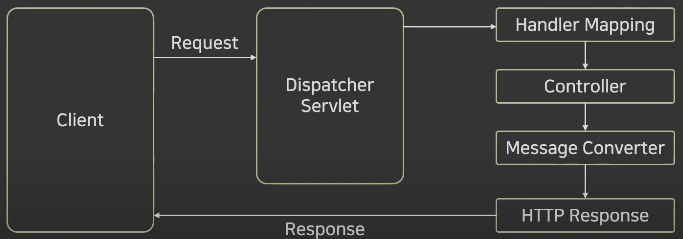

### Spring Controller Summary FLow




---
### GET API

`@GetMapping`
+ 별도의 파라미터 없이 GET API를 호출하는 경우 사용

`@PathVariable`
+ GET 형식 요청에서 파라미터를 전달하기 위해 URL에 값을 담아 요청하는 방법
+ 아래 예시는 @GetMapping에서 사용된 {변수} 이름과 메서드의 매개변수와 일치시켜야 함

```java
@GetMapping(value="/variable1/{variable}")
public String getVariable1(@PathVariable String variable){
    return variable;
}
```

+ 아래 예시는 @GetMapping에서 사용된 {변수} 이름과 메서드의 매개변수가 다를 경우 사용하는 방법
+ 변수의 관리 용이를 위해 사용됨

```java
@GetMapping(value="/variable2/{variable}")
public String getVariable2(@PathVariable("variable") String var){
    return var;
}
```

`@RequestParam`
+ GET 형식 요청에서 쿼리 문자열을 전달하기 위해 사용되는 방법
+ '?'를 기준으로 우측에 {키}={값} 형태로 전달되며, 복수 형태로 전달할 경우 '&'를 사용

> http://naver.com/api/v1/request1?name=sen&email=sen@naver.com&organic=senground

```java
@GetMapping(value="/request1")
public String getRequestParam1(
    @RequestParam String name,
    @RequestParam String email,
    @RequestParam String organic){
    return name + "" + email + "" + organic;
}
```

+ 아래 예시는 어떤 요청 값이 들어올지 모를 경우 사용하는 방법

```java
@GetMapping(value="/request2")
public String getRequestParam2(@RequestParam Map<String, String> param){
    StringBuilder sb = new StringBuilder();
    
    param.entrySet().forEach(map -> {
        sb.append(map.getKey() + ":" + map.getValue() + "\n");
    });
    
    return sb.toString();
}
```

`DTO 사용`
+ GET 형식 요청에서 쿼리 문자열을 전달하기 위해 사용되는 방법
+ key와 value가 정해져있지만, 받아야할 파라미터가 많을 경우 DTO 객체를 사용

```java
@GetMapping(value="/request3")
public String getRequestParam3(MemberDTO memberDTO){
    return memberDTO.getName() + "" + memberDTO.getEmail() + "" + memberDTO.getOrganic();
}

public class MemberDTO {
    private String name;
    private String email;
    private String organic;
}
```

---
### POST API

`@PostMapping`
+ POST API를 제작하기 위해 사용되는 어노테이션(Annotation)
+ 리소스를 추가하기 위해 사용되는 API
+ 일반적으로 추가하고자 하는 Resource를 http body에 추가하여 서버에 요청
+ 그렇기 때문에 @RequestBody를 이용하여 body에 담겨있는 값을 받아야 함

```java
@PostMapping(value = "/member")
public String postMember(@RequestBody Map<String, Object> postData){
    StringBuilder sb = new StringBuilder();
    
    postData.entrySet().forEach(map -> {
        sb.append(map.getKey() + ":" + map.getValue() + "\n");
    });
    
    return sb.toString();
}
```

`DTO 사용`
+ key와 value가 정해져있지만, 받아야할 파라미터가 많을 경우 DTO 객체를 사용 

```java
@PostMapping(value = "/member2")
public String postMemberDto(@RequestBody MemberDTO memberDTO){
    return memberDTO.toString();
}
```

---
### PUT API
+ 해당 리소스가 존재하면 갱신하고, 리소스가 없을 경우에는 새로 생성해주는 API
+ 업데이트를 위한 메서드
+ 기본 동작 방식은 POST API와 동일함

### DELETE API
+ 서버를 통해 리소스를 삭제하기 위해 사용되는 API
+ 일반적으로 @PathVariable을 통해 리소스 ID 등을 받아 처리

`@ResponseEntity`
+ Spring Framework에서 제공하는 클래스 중 HttpEntity라는 클래스를 상속받아 사용하는 클래스
+ 사용자의 HttpRequest에 대한 응답 데이터를 포함

포함하는 클래스
+ HttpStatus
+ HttpHeaders
+ HttpBody

---
### 협업을 위해 필요한 라이브러리 Swagger
+ 스웨거 이전 API 개발 협업을 위해서는 `Excel, Word` 등 응용프로그램을 사용해 API를 소개하고 스펙을 작성해서 공유했다.
+ 이러한 작업은 API 변경 사항이 있을 때마다 다시 수기로 작성해야하는 불편함이 있었고 이를 해결하기 위해 문서화 해주는 라이브러리가 만들어졌다.

`Swagger`
+ 서버로 요청되는 API 리스트를 HTML 화면으로 문서화하여 테스트 할 수 있는 라이브러리
+ 이 라이브러리는 서버가 가동되면서 `@RestController`를 읽어 API를 분석해 HTML 문서를 작성한다
+ 이 프로젝트에서는 `Swagger`와 같은 역할을 하는 `Springdoc`을 사용해 문서화함
+ `Spring Boot 2.x and 1.x`는 `springdoc-openapi v1.x.x`을 사용했고 `Spring Boot 3.x`는 `springdoc-openapi-starter-webmvc-ui v2.x.x`을 사용한다.

`Swagger 설정 방법`
+ `@Configuration` 어노테이션 기반의 환경 구성을 돕는 어노테이션, IoC Container에게 해당 클래스를 Bean 구성 Class임을 알려줌
+ `@Bean` 개발자가 직접 제어가 불가능한 외부 라이브러리 등을 Bean으로 만들 경우에 사용

---
### Lombok
+ 반복되는 메서드를 `Annoation`을 사용해 자동으로 작성해주는 라이브러리
+ 일반적으로 VO, DTO, Model, Entitry 등의 데이터 클래스에서 주로 사용
+ 대표적으로 많이 사용되는 Annotation
  + @Getter
  + @Setter
  + @NoArgsConstructor
  + @AllArgsConstructor
  + @Data
  + @ToString

`Getter와 Setter`
+ 해당 클래스에 선언되어 있는 필드를 기반으로 'getField','setField'와 같은 메서드를 자동 생성

`NoArgsConstructor, AllArgsConstructor, RequiredArgsConstructor`
+ @NoArgsConstructor: 파라미터가 없는 생성자를 자동 생성
+ @AllArgsConstructor: 모든 필드값을 파라미터로 가지는 생성자를 자동 생성
+ @RequiredArgsConstructor: 필드 값 중 final이나 @NotNull인 값을 가지는 생성자를 자동 생성

`ToString`
+ toString() 메서드를 자동 생성해주는 기능
+ @ToString 어노테이션에 exclude 속성을 사용해 특정 필드를 toString에서 제외시킬 수 있다

`@EqualsAndHashCode`
+ equals, hashCode 메서드를 자동으로 생성
+ equals: 두 객체의 내용이 같은지 동등성(equality)을 비교하는 연산자
+ hashCode: 두 객체가 같은 객체인지 동일성(identity)을 비교하는 연산자
+ callSuper 속성을 통해 메서드 생성 시 부모 클래스의 필드까지 고려할지 여부 설정 가능
  + callSuper = true → 부모 클래스 필드 값들도 동일한지 체크

`@Data`
+ 해당 어노테이션을 사용하면, 앞서 나온 기능들을 한번에 추가해준다
  + @Getter
  + @Setter
  + @RequiredArgsConstructor
  + @ToString
  + @EqualsAndHashCode
+ 하지만, 불필요한 어노테이션을 포함할 수 있기 때문에 유의해야함

---
