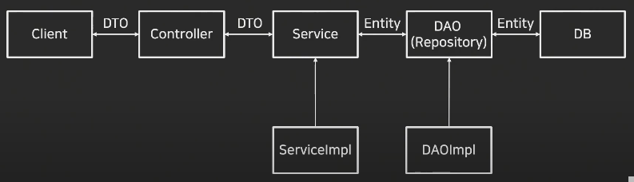
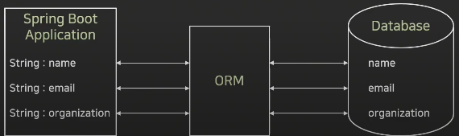
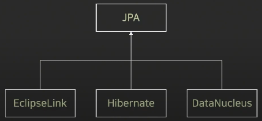
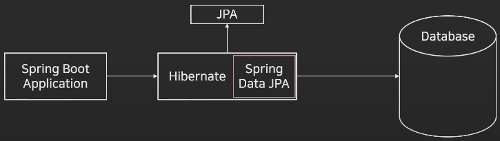

### Spring Boot 서비스 기본 구조



---
### Entity(Domain)
+ 데이터베이스에 쓰일 컬럼과 여러 엔티티 간의 연관관계를 정의
+ 데이터베이스의 테이블을 하나의 엔티티로 생각해도 무방함
+ 실제 데이터베이스의 테이블과 1:1로 매핑됨
+ 이 클래스의 필드는 각 테이블 내부의 컬럼(Column)을 의미

---
### DAO

`Repository`
+ Entity에 의해 생성된 데이터베이스에 접근하는 메서드를 사용하기 위한 인터페이스
+ Service와 DB를 연결하는 고리의 역할을 수행
+ 데이터베이스에 적용하고자 하는 CRUD를 정의하는 영역

`DAO(Data Access Object)`
+ 데이터베이스에 접근하는 객체를 의미 (Persistence Layer)
+ Service가 DB에 연결할 수 있게 해주는 역할
+ DB를 사용하여 데이터를 조회하거나 조작하는 기능을 전담

`DTO(Data Transfer Object)`
+ 목적
  + 주로 데이터 전송을 위해 사용된다. 네트워크 간, 계층 간 데이터 전송이 필요한 경우, 객체 형태로 데이터를 전달하기 위해 사용된다.
+ 특징
  + 데이터 전송에 필요한 속성을 가지고 있으며, 메서드가 대부분 비어있거나 간단한 접근자/생성자 메서드만을 가진다.
  + 일반적으로 가볍고 불변성을 가지는 것이 좋다.
  + 특정 비즈니스 로직이나 동작을 포함하지 않는다.
+ 예시
```java
public class UserDTO {
    private String username;
    private String email;
    
    // getters, setters, toString 
}
```


`VO(Value Object)`
+ 목적
  + 비슷한 속성을 가진 객체들을 구분하기 위해 사용된다. 주로 도메인 모델 내에서 특정 값을 나타내기 위해 사용된다.
+ 특징
  + 불변성을 가지는 것이 일반적이며, 주로 값에 의한 동등성(equality)을 기반으로 한다.
  + 주로 비즈니스 로직을 가지며, 특정 규칙에 따라 동작하는 메서드를 포함할 수 있다.
  + 데이터의 불변성을 보장하여 변경이 발생하면 새로운 객체를 생성하는 경우가 많다.
+ 예시

```java
public class MoneyVO {
  private final BigDecimal amount;
  private final Currency currency;
  
  public MoneyVO(BigDecimal amount, Currency currency){
      this.amount = amount;
      this.currency = currency;
  }
  
  // getters, equals, hashCode 메서드 등
}
```

`DTO vs VO 차이점`
+ 둘 다 객체지향 프로그래밍에서 데이터를 캡슐화하고 전달하는 데 사용되는 개념이지만, 목적과 사용 방법에서 차이가 있다.
+ DTO는 주로 데이터 전송을 위해 사용되는 객체이며, 비즈니스 로직을 가지지 않는다.
+ VO는 주로 도메인 모델에서 특정 값을 나타내기 위해 사용되며, 불변성과 비즈니스 로직을 가지는 것이 특징이다.
+ 두 개념은 서로 다른 목적과 사용 사례에 맞게 선택해야 한다.


---
### ORM(Object Relational Mapping)

`ORM`
+ 애플리케이션의 객체와 관계형 데이터베이스의 데이터를 자동으로 매핑해주는 것을 의미
  + Java의 데이터 클래스와 관계형 데이터베이스의 테이블을 매핑
+ 객체지향 프로그래밍과 관계형 데이터베이스의 차이로 발생하는 제약사항을 해결해주는 역할을 수행
+ 대표적으로 JPA, Hibernate 등이 있음 (Persistent API)



`ORM 장점`
+ SQL 쿼리가 아닌 직관적인 코드로 데이터를 조작할 수 있다
  + 개발자가 보다 비즈니스 로직에 집중할 수 있다
+ 재사용 및 유지보수가 편리하다
  + ORM은 독립적으로 작성되어 있어 재사용이 가능
  + 매핑정보를 명확하게 설계하기 때문에 따로 데이터베이스를 볼 필요가 없음
+ DBMS에 대한 종속성이 줄어든다
  + DBMS를 교체하는 작업을 비교적 적은 리스크로 수행 가능

`ORM 단점`
+ 복잡성이 커질 경우 ORM만으로 구현하기 어렵다
  + 직접 쿼리를 구현하지 않아 쿼리를 직접 작성할 때는 다른 라이브러리를 사용해 구현
+ 잘못 구현할 경우 속도 저하 발생
  + 코드로 작성한 쿼리를 실제 SQL 언어로 컨버팅하는 작업이 존재한다
+ 대형 쿼리는 별도의 튜닝이 필요할 수 있다

`JPA`
+ JPA는 Java Persistance API의 줄임말이고, ORM과 관련된 인터페이스의 모음
+ Java 진영에서 표준 ORM으로 채택됨
+ ORM이 큰 개념이라고 하면, JPA는 더 구체화 시킨 스펙을 포함함

`Hibernate`
+ ORM Framework 중 하나
+ JPA의 실제 구현체 중 하나이고, 현재 JPA 구현체 중 가장 많이 사용됨



### Spring Data JPA
+ Spring Framework에서 JPA를 편리하게 사용할 수 있게 지원하는 라이브러리
  + CRUD 처리용 인터페이스 제공
  + Repository 개발 시 인터페이스만 작성하면 구현 객체를 동적으로 생성해서 주입
  + 데이터 접근 계층 개발시 인터페이스만 작성해도 됨
+ Hibernate에서 자주 사용되는 기능을 조금 더 쉽게 사용할 수 있게 구



---